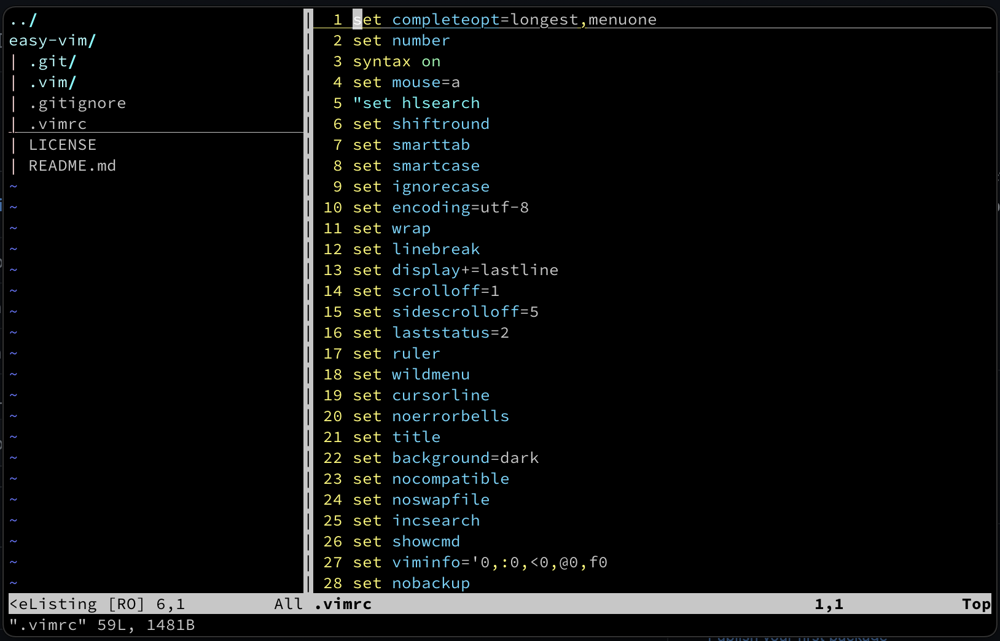

# easy-vim

The whole purpose of this is my annoyance towards those vim plugins that reqiuire python or node plugins. 

## Plan

My plan is to use built-in vim completion, with some tweaks. It sometimes works good, but needs some tweaks.

## Instalation

Just copy .vimrc and .vim to your home directory.

